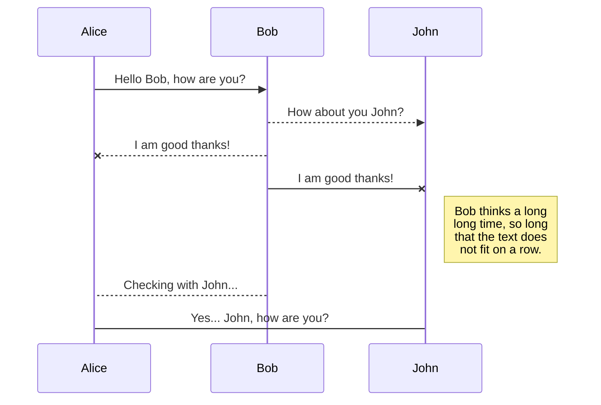
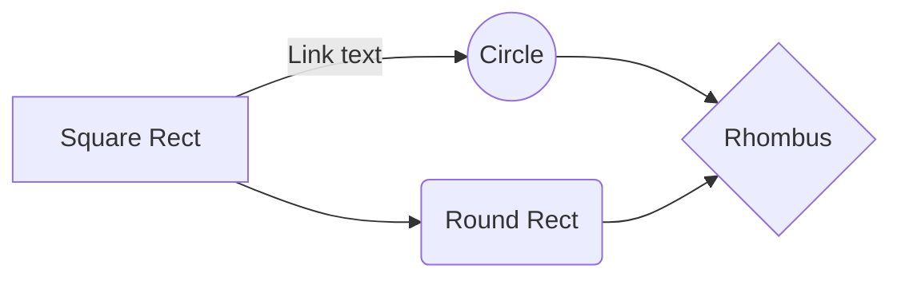

# Markdown Guide

## Introduction

Markdown is a lightweight markup language with plain-text-formatting syntax. Its design allows it to be converted to many output formats, but the original tool by the same name only supports HTML. Markdown is often used to format readme files, for writing messages in online discussion forums, and to create rich text using a plain text editor.

---

## Headers Syntax

Use `#` to create headers. The number of `#`s indicates the level of the header.

```markdown
# Header 1

## Header 2

### Header 3

#### Header 4

##### Header 5

###### Header 6
```

will render as:

# Header 1

## Header 2

### Header 3

#### Header 4

##### Header 5

###### Header 6

---

## Styling

*Emphasize*
use: `*Emphasize*` `_emphasize_`

**Strong**
use: `**Strong**` `__strong__`

==Marked text.==
use: `==Marked text.==`

~~Mistaken text.~~
use: `~~Mistaken text.~~`

> Quoted text.
use: `> Quoted text.`

---

## Lists

```markdown
- Item
    * Item
        + Item

1. Item 1
2. Item 2
3. Item 3

- [ ] Incomplete item
- [x] Complete item

```

---

## Links

```markdown
A [link](http://example.com).

An image: 

A sized image: 
```

---

## Code

```markdown
Some `inline code`.
```

```markdown
    ```
    // A code block
    var foo = 'bar';
    ```
```

```markdown
    ```javascript // Code language
    // An highlighted block
    var foo = 'bar';
    ```
```

---

## Tables

Item     | Value
-------- | -----
Computer | $1600
Phone    | $12
Pipe     | $1

use:

```markdown

Item     | Value
-------- | -----
Computer | $1600
Phone    | $12
Pipe     | $1
```

| Column 1 | Column 2      |
|:--------:| -------------:|
| centered | right-aligned |

use:

```markdown
| Column 1 | Column 2      |
|:--------:| -------------:|
| centered | right-aligned |
```

---

## LaTeX math expressions

You can render LaTeX mathematical expressions using [KaTeX](https://khan.github.io/KaTeX/):

The *Gamma function* satisfying $\Gamma(n) = (n-1)!\quad\forall n\in\mathbb N$ is via the Euler integral

$$
\Gamma(z) = \int_0^\infty t^{z-1}e^{-t}dt\,.
$$

> You can find more information about **LaTeX** mathematical expressions [here](http://meta.math.stackexchange.com/questions/5020/mathjax-basic-tutorial-and-quick-reference).

use:

```markdown
The *Gamma function* satisfying $\Gamma(n) = (n-1)!\quad\forall n\in\mathbb N$ is via the Euler integral

$$
\Gamma(z) = \int_0^\infty t^{z-1}e^{-t}dt\,.
$$
```

---

## UML diagrams

You can render UML diagrams using [Mermaid](https://mermaidjs.github.io/). For example, this will produce a sequence diagram:



use:
```markdown
    ```mermaid
    sequenceDiagram
    Alice ->> Bob: Hello Bob, how are you?
    Bob-->>John: How about you John?
    Bob--x Alice: I am good thanks!
    Bob-x John: I am good thanks!
    Note right of John: Bob thinks a long<br/>long time, so long<br/>that the text does<br/>not fit on a row.

    Bob-->Alice: Checking with John...
    Alice->John: Yes... John, how are you?
    ```
```

And this will produce a flow chart:


use:

```markdown
    ```mermaid
    graph LR
    A[Square Rect] -- Link text --> B((Circle))
    A --> C(Round Rect)
    B --> D{Rhombus}
    C --> D
    ```
```

## References

- [Markdown Guide](https://www.markdownguide.org/)
- [Markdown Cheatsheet](https://github.com/adam-p/markdown-here/wiki/Markdown-Cheatsheet)
- [StackEdit](https://stackedit.io/)
- [KaTeX](https://katex.org/)
- [Mermaid](https://mermaid.js.org/)
- [Mermaid Live Editor](https://mermaid-js.github.io/mermaid-live-editor/)

---

[🏠 Back to 26A-10221 Advanced Seminar in Mobile Development](../README.md)

© 2026 Afeka - Tel Aviv's College of Engineering