# Assignment Specifications

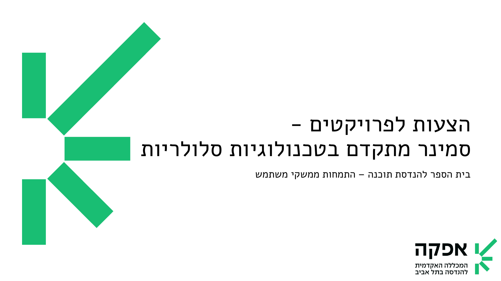

## Deadline

**Submission Date:** January 25th, 2026 at 23:59 via Moodle, as GitHub repository links. And a presentation in class on January 26th, 2026 at 5pm in class Z4.

## Project Requirements

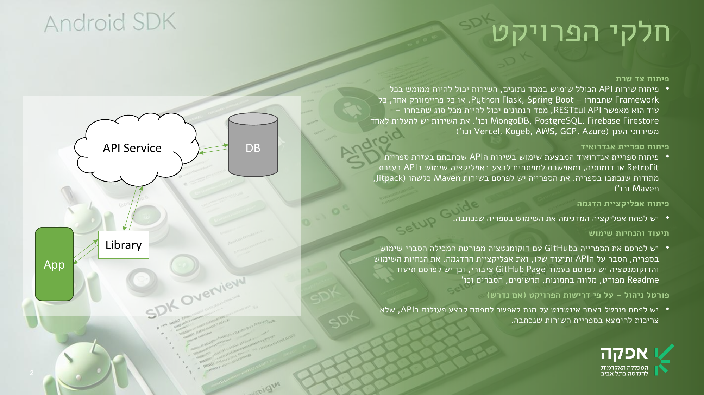

1. **API Service:** Develop the backend API service, including the database connection and CRUD operations. Can be developed using Flask, Spring Boot, or any other backend framework, as long as it provides a RESTful API. The Api service should be deployed to a cloud service provider (e.g., [Vercel](https://vercel.com/), [Koyeb](https://app.koyeb.com/), [AWS](https://aws.amazon.com/), [GCP](https://cloud.google.com/), etc.), and the database should be hosted on a cloud database service (e.g., [MongoDB Atlas](https://www.mongodb.com/products/platform/atlas-database), [Firebase](https://console.firebase.google.com/), etc.).
2. **Android Library:** Develop the Android library for developers to integrate into their applications, using the API service. The library should provide methods to interact with the API service endpoints. The library should be published to a public repository (e.g., JitPack) for easy integration. The library can be developed using Java or Kotlin.
3. **Android Example Application:** Develop an Android Example application that consumes the Android library and interacts with the API service through the library methods. The application should demonstrate the usage of the library and showcase the features provided by the API service. The application should be well-documented and include setup instructions. The application can be developed using Java or Kotlin.
4. **Documentation:** Prepare the documentation for the API service, Android library, and Android Example application. Include the setup instructions, usage examples, and any additional information that might be useful for developers. The documentation should be clear, concise, and easy to follow. Include screenshots, diagrams, and code snippets where necessary. The documentation should be stored in a `docs` folder in the project repository and should be published as a GitHub Page. The documentation should be accessible via a link in the project's `README.md` file. Can be developed using Markdown, HTML, or any other documentation format.
5. **Readme:** Prepare a `README.md` file that covers the project's architecture, components, features, and usage examples. Include screenshots, diagrams, and any other visual aids that can help understand the project.
6. **License:** Include a `LICENSE` file in the project repository to specify the project's usage terms. You can use an open-source license (e.g., MIT, Apache 2.0) or any other license that suits your project's requirements.
7. **Administration Portal (IF NEEDED):** Develop an administration portal to manage the API service data. The portal should provide CRUD operations for the data stored in the database. The portal should be accessible via a web browser and should be secured with authentication and authorization mechanisms. The portal can be developed using any web development framework.

## SDK Ideas

### Idea #1 - Name Finder SDK

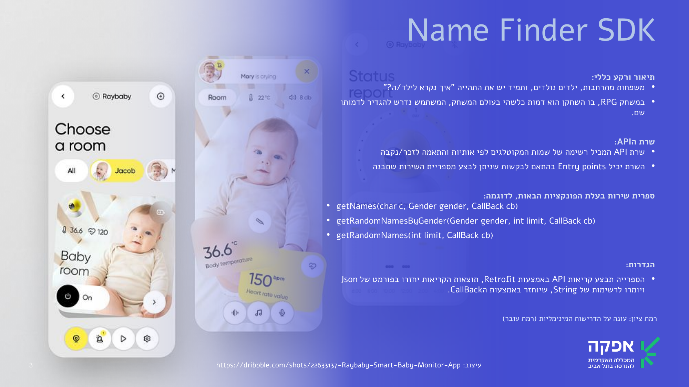

### Idea #2 - Feature Toggle SDK

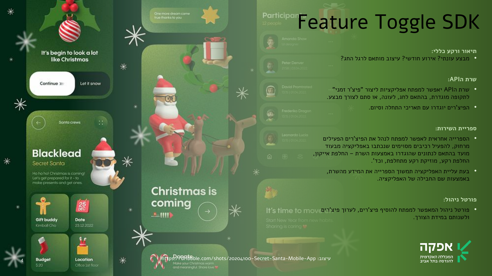

### Idea #3 - Image Ads SDK

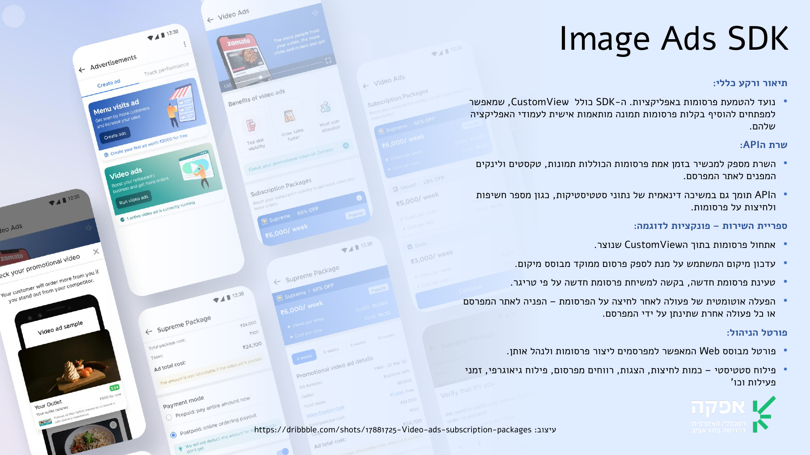

### Idea #4 - Video Ads SDK

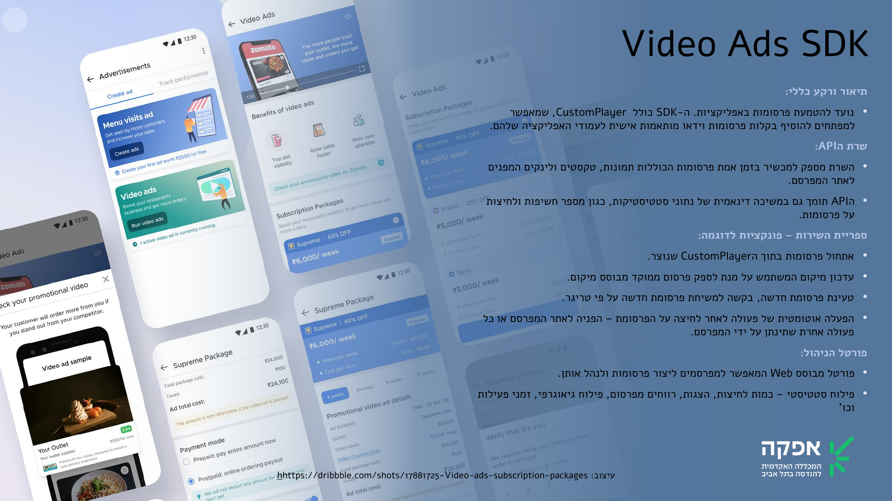

### Idea #5 - Is In Country SDK

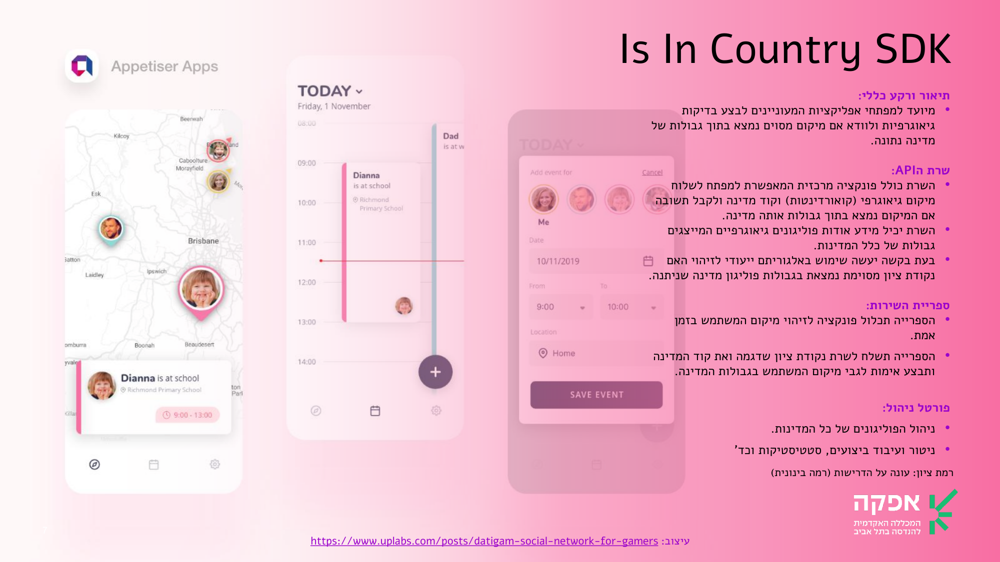

### Idea #6 - Chat SDK

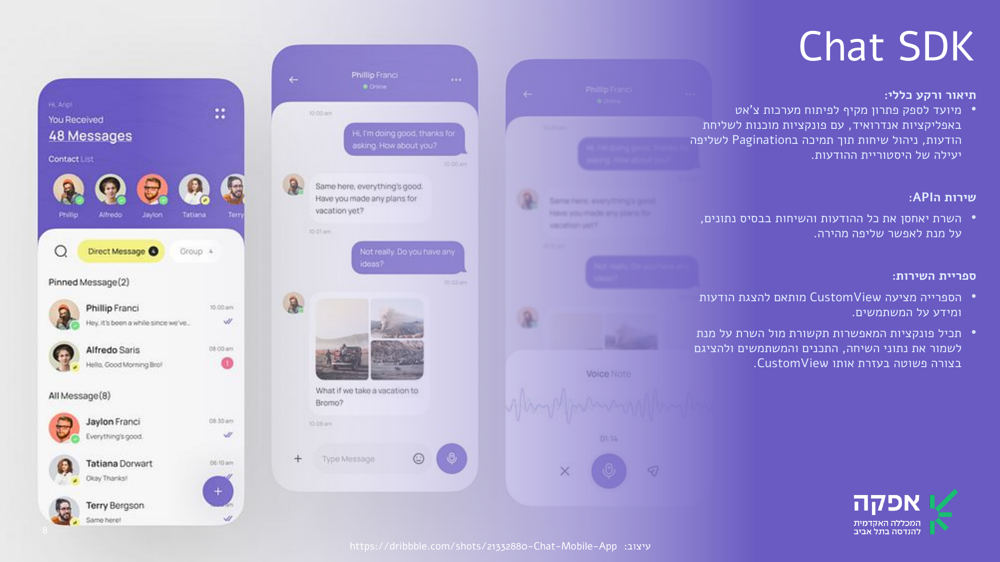

### Idea #7 - Stock Market SDK

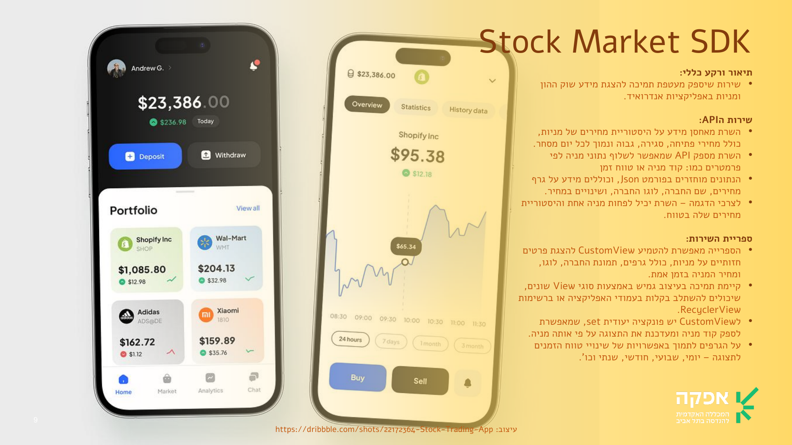

### Idea #8 - Analytics SDK

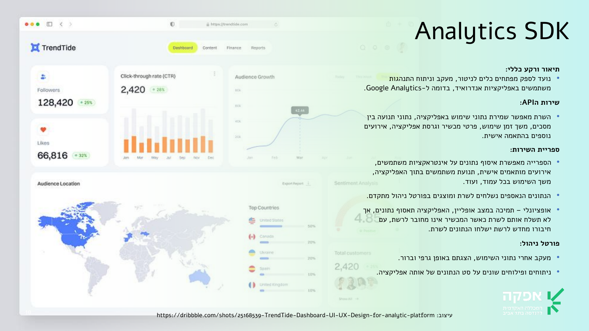

### Idea #9 - Crash Reports SDK

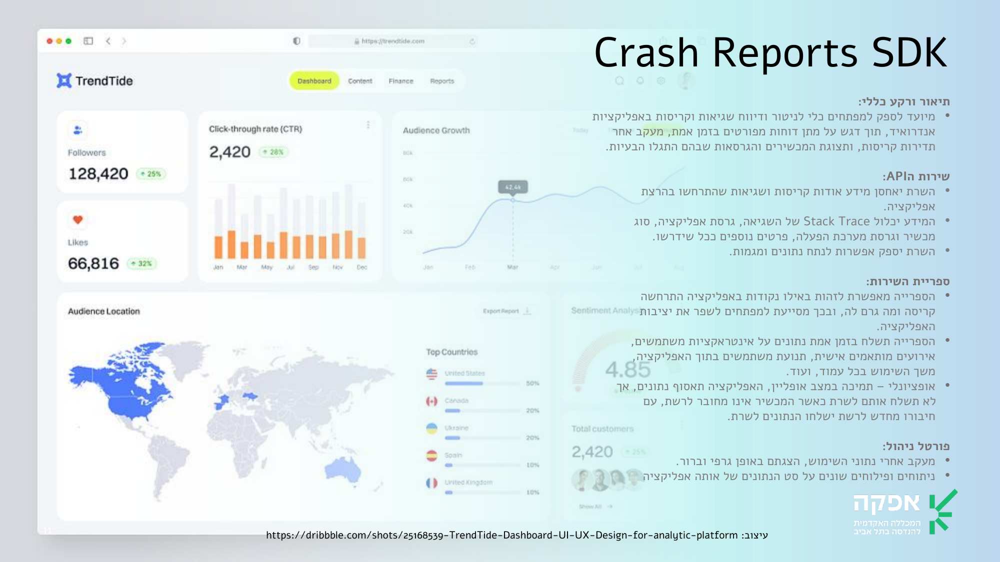

### Idea #10 - Call Logger SDK

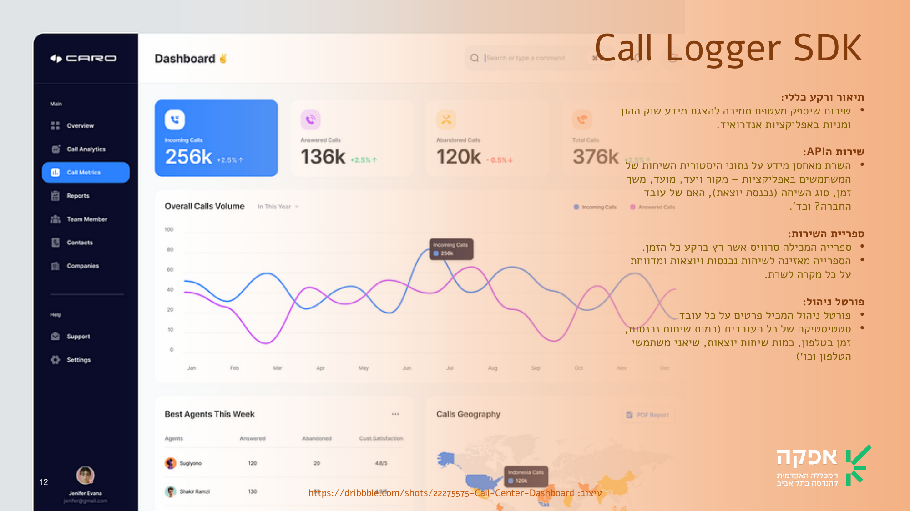

---

[🏠 Back to 26A-10221 Advanced Seminar in Mobile Development](../README.md)

© 2026 Afeka - Tel Aviv's College of Engineering